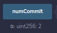

# RWAPSSF

## Introduction

This is a simple project to Rock Water Air Paper Sponge Scissors Fire game with commit-reveal mechanism using Solidity.

## Problems and Solutions

### Front-running problem

After the first player commits to a move, the second player can see the first player's move and choose their move accordingly. This is a problem because the second player can always win by choosing the move that beats the first player's move.

To solve this problem, we use a **commit-reveal mechanism**. The players commits to a move by hashing it with a random number (salt). After both players have committed to a move, they can not change their move. Then, they reveal their move and the random number. The contract verifies that the hash of the move and the random number is the same as the committed hash. This way, the second player can not see the first player's move before choosing their move.

See also:

- https://github.com/lazykern/RWAPSSF/commit/34ad55f10b3a5d1e851ceb172ed2aca26286c401
- https://github.com/lazykern/RWAPSSF/commit/0a91264437eafef5526f1f65d100332ab67e2fc1

### Fund holding problem

After the player participates in the game, the contract holds the player's fund. The player can not withdraw the fund until the game is finished. There might be a situation where another player does not join, commit, or reveal the move. In this case, the player's fund is locked in the contract.

To solve this problem, we use a **timeout mechanism**.

- If the second player does not join the game within a certain time, the first player can withdraw their fund.
- If the any player does not commit their move within a certain time, all players can withdraw their fund.
- If the all player does not reveal their move within a certain time, all players can withdraw their fund.
- If a player reveals their move and the other player does not reveal their move within a certain time, the player is considered as the winner.

See also:

- https://github.com/lazykern/RWAPSSF/commit/5404bf01186cda8c6a86527f610fc416ce4a3f0c
- https://github.com/lazykern/RWAPSSF/commit/f16c5b5659cd145b5ccdf0a4540241045fcef5ed
- https://github.com/lazykern/RWAPSSF/commit/e121524b7e923a3d733d52f579f2df220a121d72

## Snapshots

### 1. Winning and Losing

Default state:

- Player 1: `0x5B38Da6a701c568545dCfcB03FcB875f56beddC4`, 100 ether
- Player 2: `0xAb8483F64d9C6d1EcF9b849Ae677dD3315835cb2`, 100 ether

#### 1.1. Player 1 and Player 2 joins (both bet 1 ether) using `addPlayer`

#### 1.2. Player 1 and Player 2 commit their move using `commitChoice`

- Player 1 chooses `rock`
- Player 2 chooses `water`

#### 1.3. Player 1 and Player 2 reveal their move using `revealChoice`

- Player 1 reveals `rock`
- Player 2 reveals `water`
- Player 2 wins and gets 2 ether

### 2. Draw

Default state:

- Player 1: `0x5B38Da6a701c568545dCfcB03FcB875f56beddC4`, 98 ether
- Player 2: `0xAb8483F64d9C6d1EcF9b849Ae677dD3315835cb2`, 100 ether

#### 2.1. Player 1 and Player 2 joins (both bet 1 ether) using `addPlayer`

#### 2.2. Player 1 and Player 2 commit their move using `commitChoice`

- Player 1 chooses `rock`
- Player 2 chooses `rock`

#### 2.3. Player 1 and Player 2 reveal their move using `revealChoice`

- Player 1 reveals `rock`
- Player 2 reveals `rock`
- Draw, both players get 1 ether back

